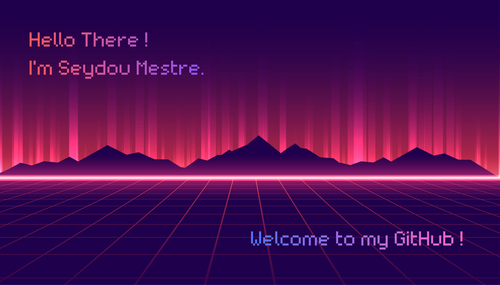
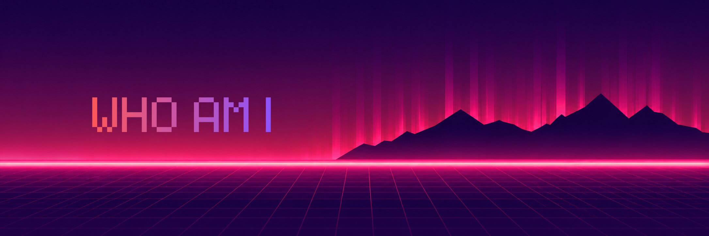

  

<h1 align="center">
  
</h1>

<h3 align="center">Software Engineering student @ 42 Paris 🇫🇷</h3>

  
  

  

- 🔭 Currently building out **Inception-of-Things** — K3s/K3d clusters, Vagrant provisioning & GitOps with Argo CD
- 🌱 Learning DevOps & container orchestration, and getting Django-ready for the **Transcendence** project
- 🛠️ Past builds include a full **IRC server** in C++ and a Unix shell (**Minishell**) in C, both from the 42 core curriculum
- 💬 Ask me about C/C++, low-level systems programming, or 42 Paris life

## 🚀 Featured Projects

  <table>
    <tr>
      <td width="50%">
        <b>☸️ Inception-of-Things</b> — K3s Cluster & GitOps 
        Building K3s/K3d Kubernetes clusters from scratch with Vagrant, ingress routing, and automated GitOps continuous deployment with Argo CD. 
            
        <a href="https://github.com/Ceidoux/Inception-of-Things">Repo →</a>
      </td>
      <td width="50%">
        <b>💬 IRC</b> — Internet Relay Chat Server 
        An RFC-compliant IRC server implemented from scratch in C++, handling multiple clients, channels, and operator commands over raw sockets. 
         
        <a href="https://github.com/Ceidoux/IRC">Repo →</a>
      </td>
    </tr>
    <tr>
      <td width="50%">
        <b>🐚 Minishell</b> — Unix Shell From Scratch 
        A Bash-like shell built in C — parsing, pipes, redirections, builtins, and signal handling implemented without a shell library. 
         
        <a href="https://github.com/Ceidoux/Minishell">Repo →</a>
      </td>
      <td width="50%">
        <b>🐍 Django-Learning</b> — Django Fundamentals 
        First steps with Django, laid down as groundwork ahead of the 42 Transcendence project. 
          
        <a href="https://github.com/Ceidoux/Django-Learning">Repo →</a>
      </td>
    </tr>
  </table>

## 🛠️ Languages And Tools

  <table>
    <tr>
      <td align="center" width="50%">
        <b>💻 Languages</b>  
        
      </td>
      <td align="center" width="50%">
        <b>🌐 Web & Backend</b>  
        
      </td>
    </tr>
    <tr>
      <td align="center" width="50%">
        <b>🐳 DevOps & Tools</b>  
        
      </td>
      <td align="center" width="50%">
        <b>🖥️ Systems</b>  
        
      </td>
    </tr>
  </table>

## 📊 GitHub Stats

  
  

